<h1 align="center">基于SpringBoot+Vue的库存管理系统【带论文】</h1>

- <b>完整代码获取地址：从戎源码网 ([https://armycodes.com/](https://armycodes.com/))</b>
- <b>技术探讨、资料分享，请加QQ群：692619798</b>
- <b>作者微信：19941326836  QQ：3645296857</b>
- <b>承接计算机毕业设计、Java毕业设计、Python毕业设计、深度学习、机器学习</b>
- <b>选题+开题报告+任务书+程序定制+安装调试+论文+答辩ppt 一条龙服务</b>
- <b>所有选题地址 ([https://github.com/Descartes007/allProject](https://github.com/Descartes007/allProject)) </b>

## 一、项目介绍

### 基于SpringBoot+Vue的库存管理系统，系统角色为系统管理员和普通用户，主要功能如下
### 管理员：
- 基本操作：登录、修改密码、获取个人信息、修改个人信息
- 系统配置管理：获取配置列表、查看配置详情、新增配置、修改配置、删除配置
- 供应商管理：筛选供应商、获取供应商列表、查看供应商详情、新增供应商、修改供应商、删除供应商
- 客户管理：筛选客户、获取客户列表、查看客户详情、新增客户、修改客户、删除客户
- 商品管理：筛选商品、获取商品列表、查看商品详情、新增商品、修改商品、删除商品、上传商品图片
- 出入库管理：筛选出入库记录、获取记录列表、查看记录详情、新增入库、新增出库、修改记录、删除记录
- 出入库明细管理：筛选明细、获取明细列表、查看明细详情、新增明细、修改明细、删除明细
- 订单管理：筛选订单、获取订单列表、查看订单详情、新增订单、修改订单、删除订单
- 公告资讯管理：筛选资讯、获取资讯列表、查看资讯详情、新增资讯、修改资讯、删除资讯
- 前台用户管理：筛选用户、获取用户列表、查看用户详情、新增用户、修改用户、删除用户
- 后台用户管理：筛选后台账号、获取账号列表、查看账号详情、新增账号、修改账号、删除账号
### 普通用户：
- 基本操作：登录、修改密码、获取个人信息、修改个人信息
- 公告资讯：获取资讯列表、查看资讯详情
- 商品管理：筛选商品、获取商品列表、查看商品详情
- 订单管理：筛选我的订单、查看订单详情、新增订单、修改订单、取消订单
- 出入库记录：查看与本人相关的出入库记录、筛选记录、查看记录详情

## 二、项目技术

- 编程语言：Java
- 项目架构：B/S 架构
- 前端技术：Vue、ElementUI、Vuex、Vue Router、Axios、SCSS
- 后端技术：Spring Boot、MyBatis-Plus、Spring MVC、Maven、MySQL

## 三、运行环境

- JDK版本：1.8及以上都可以
- 操作系统：Windows7/10、MacOS
- 开发工具：IDEA、Ecplise、MyEclipse都可以

## 四、数据库配置文件

- npm版本：6.14.13及以上都可以
- Redis版本：3.2.100及以上都可以
- 文件名：application.yml
- 编码类型：utf8

## 论文截图

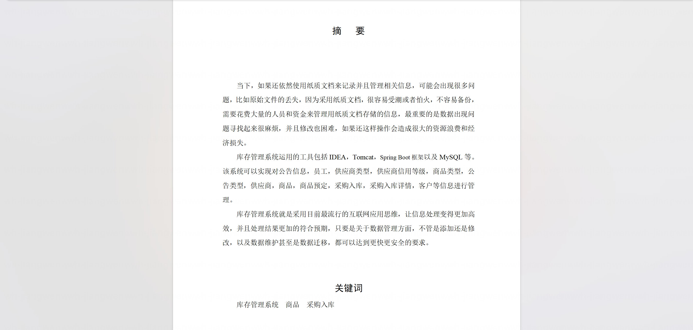

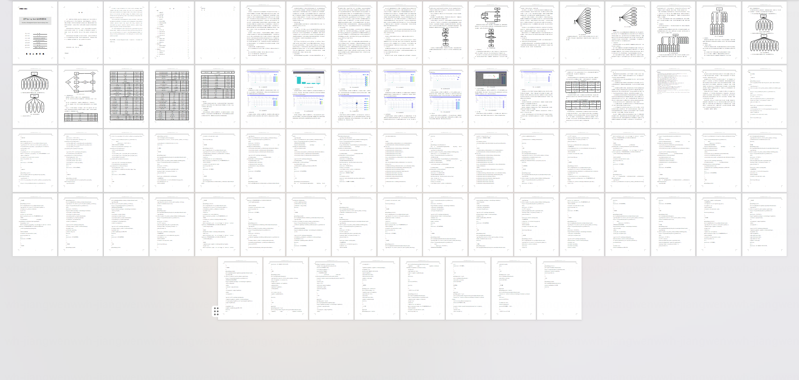

## 系统截图

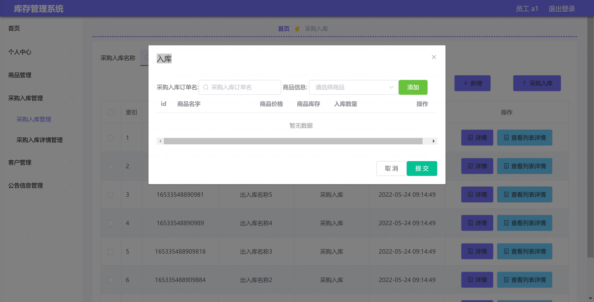

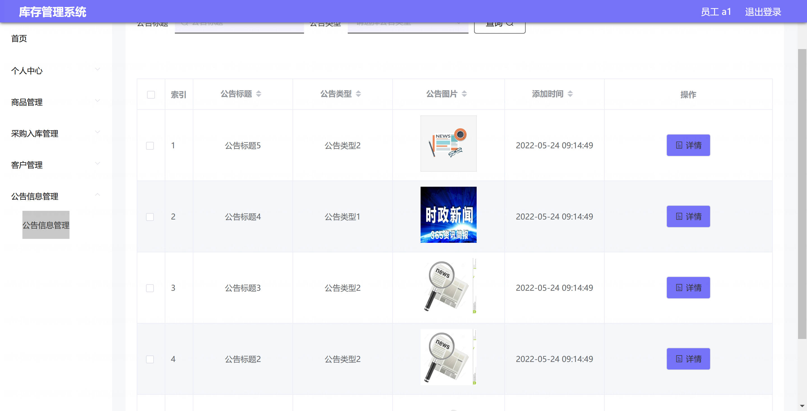

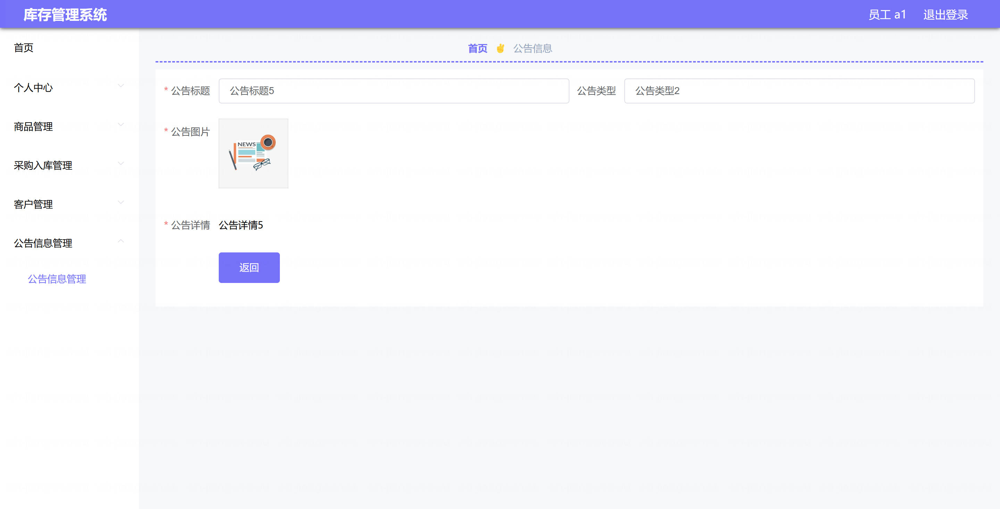

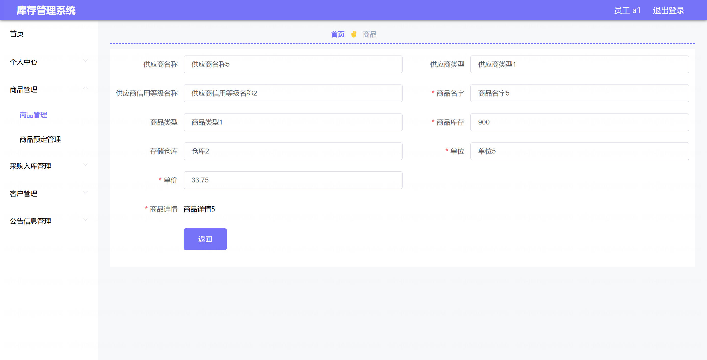

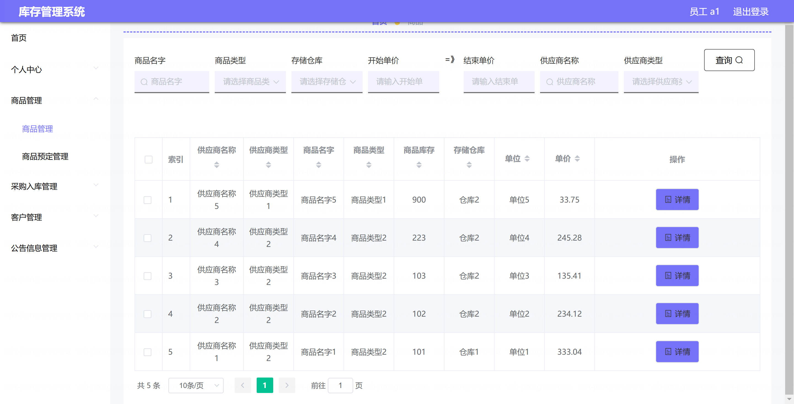

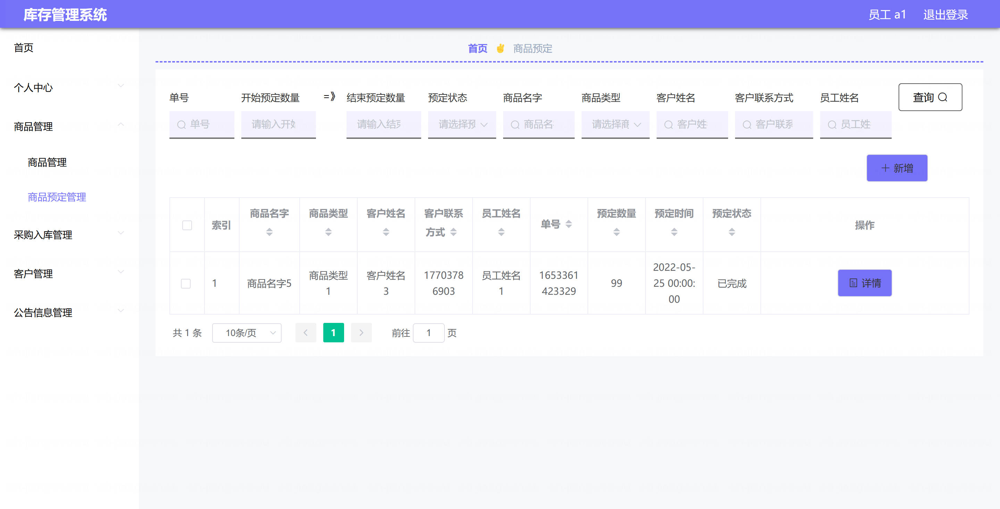

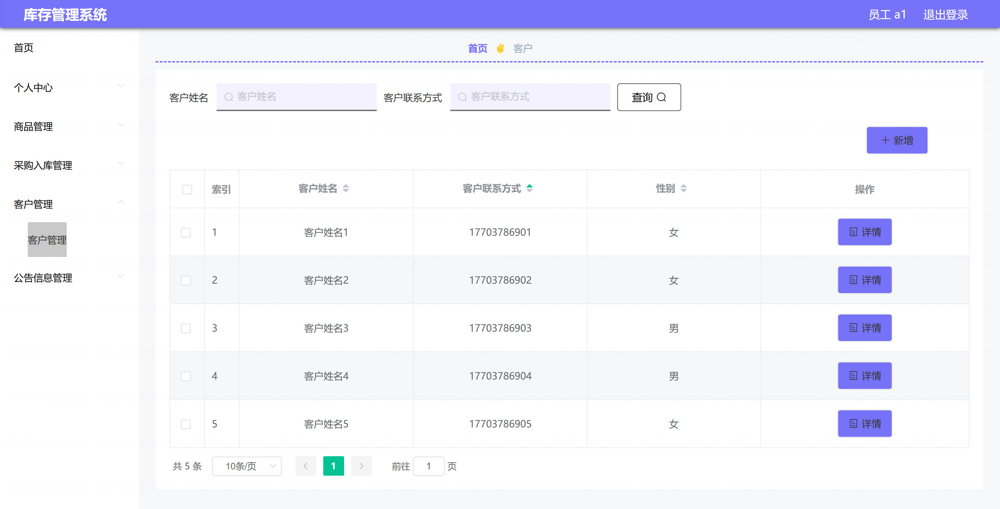

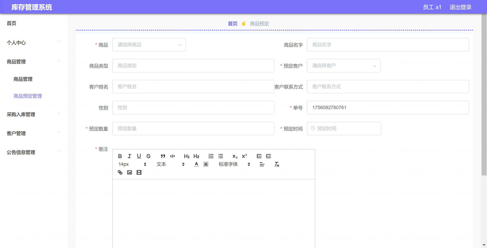

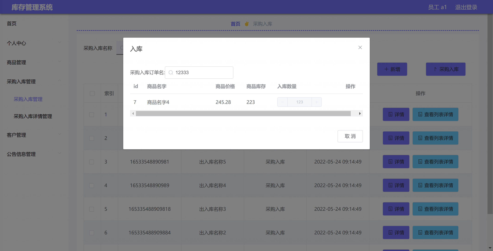

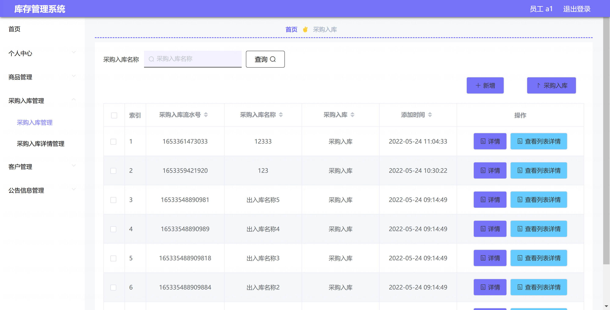
